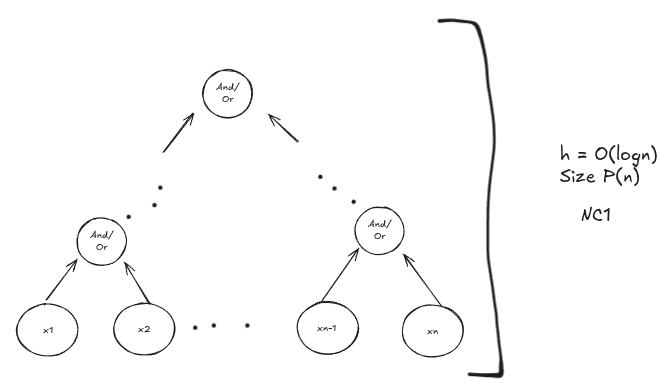
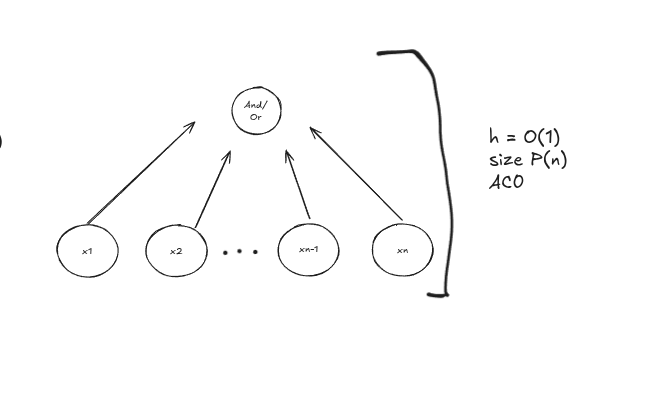

## Ejercicio 9 Probar que los lenguajes AND y OR estan en $NC^1$ usar esto para probar que $AC^d \subseteq NC^{d+1}$

Para ver que estan en $NC^1$ propongo el siguiente circuito

Analogamente se puede ver que esta en $AC^0$

Basicamente vimos que los and u or de muchos x's se puede escribir en altura O(1) en AC por el fanning arbitrario. En NC por el
fanning binario tiene altura O(log n). Veamos que cualquier C en $AC^{d}$ se puede escribir en $NC^{d+1}$:

C tiene altura $O(log^d n)$ y usa fanning arbitrario en los or y and.

Creo un C' que simula a C.

C' reemplaza cada and/or que tiene fanning arbitrario por nodos que usan fanning binario (como vimos en los circuitos).
Esto cambia la altura de esos or/and de O(1) a O(log n).

Si la altura de C es $O(log^d n)$ como en C los and/or tenian altura O(1) en C' tienen altura O(log n). 
Por lo tanto la altura de C' es $O(log^{d+1} n)$.

Entonces C' (como sigue siendo polinimial) pertenece a $NC^{d+1}$

Por lo tanto $AC^d \subseteq NC^{d+1}$

\newpage
