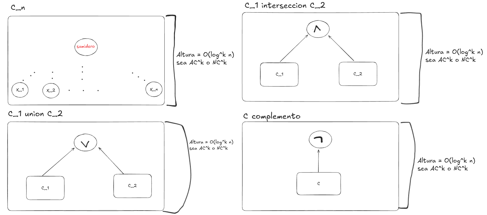

## Ejercicio 11 Decidir si las clases $AC^k$ y $NC^k$ estan cerradas por la union, interseccion y complemento.

Se ve como se pueden armar circuitos que mantienen la altura O(log^k n) y son polinomiales.

\newpage
