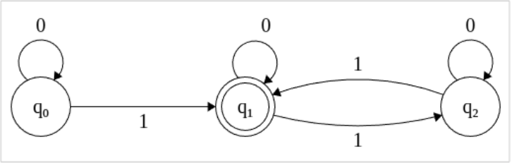

## Ejercicio 16 Sea REG el conjunto de lenguajes regulares. Probar que:

### a) $REG \not\subseteq AC^0$

Basta con dar un lenguaje que este en REG y no en $AC^0$.

Elijo Parity que se que no pertenece a $AC^0$.

Podemos hacer facilmente un AFD que reconozca Parity, es reconocer las palabras con longitud impar de 1's

### b) $AC^0 \not\subseteq REG$

Ahora propongo uno que este en $AC^0$ pero no sea regular.

$\Pi$ = {$\langle x,n \rangle : x_n = 1 \land x_n+1 =1$}

Este lenguaje claramente esta en $AC^0$. El circuito es simplemente conectar el n-esimo y el (n+1)-esimo bit 
de x a un and (sumidero)

Ahora hay que ver que el lenguaje no sea regular. Para eso veamos por el contrareciproco de pumping:

obviamente no me voy a poner a hacer pumping.

**Ejercicio para el lector!**

### c) REG  $\subseteq$ $NC^1$

Hay que probar que dado $\Pi$ un lenguaje regular cualquiera, $\Pi \in NC^1$

Hay que ver que pueda reconocer a cualquier lenguaje regular con una familia de circuitos $C_n$ polinomiales de altura O(log n) y fanning arbitrario.

Veamos que puedo simular cualquier AFD:

